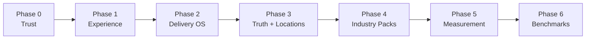

# SeenBy Premium Platform Program Index

> **For agentic workers:** Execute only one phase release gate at a time. Each linked implementation plan requires its own task-by-task tracking and verification before the next dependent phase begins.

**Goal:** Coordinate SeenBy's evolution from a capable GEO/AEO application into a premium, multi-industry operating platform while preserving the current product and reducing migration risk.

**Architecture:** Evolve the existing horizontal FastAPI/SQLAlchemy/Next.js application in place. First correct trust gaps, then reorganize the experience, add a unifying delivery lifecycle, establish location-aware truth, layer industry intelligence, strengthen measurement, and finally create privacy-safe network intelligence.

**Tech Stack:** FastAPI, SQLAlchemy, Alembic, PostgreSQL/Supabase, Pydantic, pytest, Next.js 15, React 19, TypeScript, Vitest

## Architectural Decision

The program does **not** replace SeenBy's current architecture and does **not** remove current capability data.

- Existing scores, scans, query results, recommendations, remediation items, content deliverables, work logs, reports, share links, AI traffic, and competitor evidence remain.
- Existing URLs remain compatible during the experience phase; navigation changes are presentation-level first.
- New shared layers reference or aggregate current records instead of duplicating them.
- Healthcare, F&B, and Local Services are intelligence packs over one horizontal core, not three applications.
- Data migrations are additive, reversible, and chained after the current Alembic head.
- Legacy adapters and feature flags stay until parity, backfill, and release-gate evidence are complete.
- A feature is removed only through a later, separately approved deprecation plan with usage evidence and rollback instructions.

## Phase Map

| Phase | Plan | Primary outcome | Database change | Entry gate | Exit gate |
|---|---|---|---|---|---|
| 0 | [Trust and Reliability](2026-07-29-seenby-trust-reliability.md) | Accurate scoring, claims, activity labels, value language, and methodology | No new platform tables | Current test baseline captured | Full tests plus claim/methodology audit pass |
| 1 | [Premium Experience](2026-07-29-seenby-premium-experience.md) | Outcome-led Command Center and simplified client experience | None | Phase 0 passes | Route compatibility, mobile, accessibility, and visual QA pass |
| 2 | [Delivery Operating System](2026-07-29-seenby-delivery-operating-system.md) | Evidence-to-action-to-approval-to-verification lifecycle | `outcome_actions` | Phase 0; Phase 1 contracts stable | Lifecycle, permissions, approvals, proof, migration, and recovery pass |
| 3 | [Truth Vault and Location Foundation](2026-07-29-seenby-truth-location-foundation.md) | Versioned business truth for single and multi-location organizations | `locations`, `truth_facts`, `truth_fact_versions` | Phase 2 identifiers stable | Backfill, history, ownership, RLS, and client whitelist pass |
| 4 | [Industry Intelligence Packs](2026-07-29-seenby-industry-intelligence-packs.md) | Healthcare, F&B, and Local Services specialization without product forks | Client pack/version fields | Phase 3 fact/location contracts stable | All three packs pass the same conformance, safety, and UX suite |
| 5 | [Measurement and Business Proof](2026-07-29-seenby-measurement-business-proof.md) | Repeated sampling, stability, search evidence, conversion evidence, and defensible impact | Tracked queries, normalized search signals, conversion events, sample metadata | Phases 0–4 stable | Evidence ladder, idempotency, privacy, budget, and methodology pass |
| 6 | [Benchmark and Data Moat](2026-07-29-seenby-benchmark-data-moat.md) | Privacy-safe cohorts, portfolio intelligence, and SEA AI Visibility Index | Cohorts, membership, snapshots, publications | Phase 5 coverage and comparability threshold met | Privacy attack tests, immutability, publication review, and three-pack acceptance pass |

## Required Order



This is the default release order. Phase 1 design and Phase 2 schema work may be prepared in parallel after Phase 0, but Phase 2 UI must consume the settled Phase 1 navigation and response contracts. Phase 4 pack content can be researched while Phase 3 is built, but it must not be wired until the truth schema is stable. Phase 6 may not use production data until Phase 5 comparability and privacy thresholds are demonstrably met.

## Migration Chain

```text
current head d3f7a1c58e02
  -> a8d4f2c1b7e9  Phase 2: outcome_actions
  -> b9e5a3d2c8f0  Phase 3: locations and truth vault
  -> c0f6b4e3d9a1  Phase 4: pack selection and version
  -> d1a7c5f4e0b2  Phase 5: measurement and business proof
  -> e2b8d6a5f1c3  Phase 6: benchmark data moat
```

Phase 0 and Phase 1 intentionally add no migrations. Before any phase migration ships, run upgrade, downgrade to its stated predecessor, and re-upgrade on a production-like database snapshot.

## Program Workstreams

### 1. Product trust

Owns scoring semantics, claim substantiation, terminology, evidence labels, and methodology. A new feature cannot ship if it makes a stronger claim than its stored evidence supports.

### 2. Premium experience

Owns information architecture, Command Center, client outcome navigation, mobile consumption, accessibility, and progressive evidence disclosure. It changes how capabilities are understood without discarding the underlying tools.

### 3. Delivery operations

Owns the shared Outcome Action lifecycle and adapters from recommendations, remediation, misinformation, content, and manual work. It is the connective tissue between analysis and verified results.

### 4. Truth and industry intelligence

Owns location hierarchy, approved business facts, append-only versions, pack definitions, query templates, trusted-source policies, risk routing, and specialized language.

### 5. Measurement

Owns the persistent query universe, repeat-sampling budget, stability semantics, Search Console signals, conversion normalization, and the observed/attributed/assisted/estimated evidence ladder.

### 6. Network intelligence

Owns cohort eligibility, suppression, immutable aggregate snapshots, benchmark comparison, market intelligence, publication governance, and opt-out/privacy operations.

## Cross-Phase Non-Negotiables

- **Tenant isolation:** ownership checks in services plus RLS on every new exposed table.
- **Public-link safety:** separate whitelisted schemas, expiry/revocation where state changes are allowed, rate limits, and no internal identifiers.
- **Human control:** no automatic publishing, truth approval, regulated claim approval, pack update, or benchmark publication.
- **Evidence semantics:** measured, observed, attributed, assisted, modeled, estimated, and unavailable remain distinct.
- **Auditability:** record actor, timestamp, source, version, and state transition for consequential changes.
- **Reversibility:** backfills are idempotent; legacy readers remain until parity; database downgrades are tested.
- **Cost control:** model calls respect budgets, retry policy, circuit breakers, and provider telemetry.
- **Accessibility:** keyboard, focus, contrast, responsive layout, and non-color status cues are release criteria.
- **Performance:** inspect real query plans before adding indexes; index tenant, policy, foreign-key, and time-window filters.
- **Documentation:** methodology, operations, rollback, and client-facing claim language ship with each capability.

## Release Governance

Each phase follows the same promotion sequence:

1. Run the phase's focused backend and frontend tests.
2. Run the full relevant regression suite, typecheck, production build, and `git diff --check`.
3. Verify migration upgrade/downgrade when the phase changes the database.
4. Verify RLS and cross-tenant denial with a non-owner role.
5. Complete the phase's manual acceptance scenario with screenshots or recorded evidence.
6. Review claim language, empty states, failure states, and rollback notes.
7. Release behind a feature flag when current and new paths coexist.
8. Remove a fallback only after usage, parity, and rollback evidence is approved.

## Program Success Measures

Track program progress using outcomes, not feature count:

- percentage of scored claims with traceable evidence and methodology version;
- median time from issue detection to verified Outcome Action;
- percentage of client-visible actions with owner, status, proof, and next step;
- percentage of active clients with approved, current Truth Vault coverage;
- query stability coverage and cost per stable high-value query;
- percentage of business-value figures separated by evidence level;
- share of eligible clients with privacy-safe benchmark coverage;
- retention/expansion movement after controlling for account maturity;
- support burden, client comprehension, and time-to-value.

## Stop Conditions

Pause the next phase if any of these is true:

- Phase 0 reveals unresolved score or claim integrity defects.
- A migration cannot upgrade, downgrade, or preserve existing rows.
- A public/client schema leaks an admin field or cross-tenant record.
- Industry-pack behavior requires a core fork rather than a typed extension.
- repeated sampling exceeds the approved unit-economics envelope;
- conversion evidence cannot be separated from estimates;
- a benchmark cohort fails privacy or comparability thresholds;
- full regression, build, accessibility, or operational recovery checks fail.

## Plan Inventory

1. [Phase 0 — Trust and Reliability](2026-07-29-seenby-trust-reliability.md)
2. [Phase 1 — Premium Experience](2026-07-29-seenby-premium-experience.md)
3. [Phase 2 — Delivery Operating System](2026-07-29-seenby-delivery-operating-system.md)
4. [Phase 3 — Truth Vault and Location Foundation](2026-07-29-seenby-truth-location-foundation.md)
5. [Phase 4 — Industry Intelligence Packs](2026-07-29-seenby-industry-intelligence-packs.md)
6. [Phase 5 — Measurement and Business Proof](2026-07-29-seenby-measurement-business-proof.md)
7. [Phase 6 — Benchmark and Data Moat](2026-07-29-seenby-benchmark-data-moat.md)

These seven plans are the complete premium-platform sequence. Any later feature should be assigned to one of these workstreams or proposed as a separately approved Phase 7 only after Phase 6 produces real operating data.
